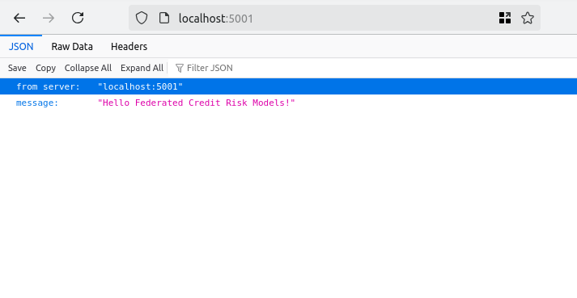
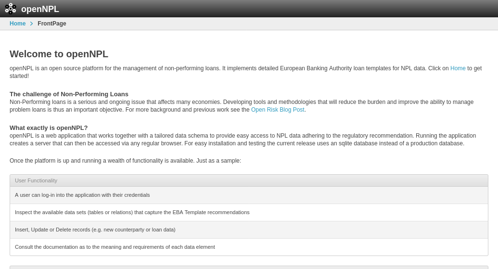

# Illustration of federated estimation of LGD models

## General Preparation

* Clone the repo in a local _linux_ environment (experienced users could probably reproduce this on a Windows environment with small modifications of the provided scrips)
* Install the dependencies (a virtual environment is recommended), e.g., pip install -r requirements.txt

### Do a standalone run as a check

Make a standalone test run to ensure the local environment, paths and dependencies are properly set up. 
* cd openLGD
* python standalone_run.py

You should get a screenshot like this:


## 1. Simple File Based Federated Demo

In the first demo, each federating model server has a local copy of the data from the filesystem 

### Spawn a cluster of model servers

* Fire up a number of flask servers on different xterm shells.
* Run the [Spawn Cluster Script](./spawn_cluster.sh)
* **Note**: The script uses ports 5001-5004. If by any chance you are already using these ports you would need to adapt the script

If all goes well you should get four xterminals with a flask server active in each one:
    


The model servers should start up on ports http://127.0.0.1:500X/ where X is their serial number

You can check the servers are live by pointing your browser to the ports



Or by using curl from a console (curl -v http://127.0.0.1:500X/)

```bash
 curl -v http://127.0.0.1:5001/
*   Trying 127.0.0.1:5001...
* Connected to 127.0.0.1 (127.0.0.1) port 5001 (#0)
> GET / HTTP/1.1
> Host: 127.0.0.1:5001
> User-Agent: curl/7.81.0
> Accept: */*
> 
* Mark bundle as not supporting multiuse
< HTTP/1.1 200 OK
< Server: Werkzeug/3.0.4 Python/3.10.12
< Date: Tue, 08 Oct 2024 21:10:50 GMT
< Content-Type: application/json
< Content-Length: 81
< Connection: close
< 
{"from server":"127.0.0.1:5001","message":"Hello Federated Credit Risk Models!"}
* Closing connection 0
```

#### Model Server API endpoints: 

The general structure of the (simplified) model server API is:

* GET http://127.0.0.1:500X/          API Root, indicating the server is live
* GET http://127.0.0.1:500X/start     URL to get initial locally estimated parameters (cold start)
* POST http://127.0.0.1:500X/update   URL to post current averaged parameters (warm start) 

### Run a federated calculation

Run the [federated_run](./federated_run.py) script to perform the federated estimation calculation. If all goes well you should get the following screenshot


The first messages confirm the servers are live and print the first local estimates send to the coordinating node

Subsequent blocks show a number of iterative estimates (epochs) where the averaged model parameters are sent back to the local servers and used to obtain the next local estimate 

## 2. Federated Demo using openNPL backends

In the second demo the data reside inside a database and are served via an openNPL server.

### Spawn a cluster of docker containers each running an openNPL instance. 

Those servers are the *data backends*. Run the [Docker Cluster Script](./docker_cluster.sh). Obviously you need to have docker installed on your machine for this to work.

**Note**: The script uses ports 8001-8004. If by any chance you are already using these ports you would need to adapt the script

Check that the data backends are operational by pointing your browser to localhost:800X. You should see something like:



### Spawn a cluster of *model servers*

```bash
fab deploycluster
```

### Run the federated calculation

* Run the [federated_run](./federated_run.py) script to perform the federated estimation calculation. If all goes well you should get the following screenshot

### Clean Up

* fab stopcluster
* docker stop $(docker ps -a -q)

  

